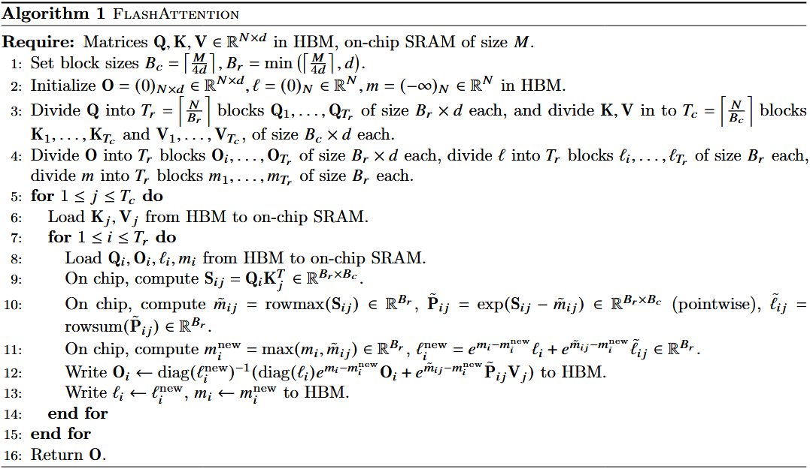

## 论文概述

论文标题：**FlashAttention: Fast and Memory-Efficient Exact Attention  with IO-Awareness**

对于 Transformer 而言，其时间和存储的复杂度对于序列长度而言是二次方的；目前的方法通过平衡模型的输出质量来减少计算的复杂度，但是无法实现 wall-clock 加速。我们认为主要的原因是由于没有考虑注意力算法的 IO-aware 原则，即 GPU 不同级别存储之间的读与写。本文提出了 FlashAttention，通过使用 tiling (分块) 来减少 GPU HBM 高带宽缓存和 GPU 片上 SRAM 的数据读写。同时，FlashAttention 可以拓展到 Block-sparse attention 上，相较于目前已有的方法都要更好。

## 介绍

一个重要的问题是如何使得 attention 操作更加快速并且存储有效来帮助 Transformer 解决其在长序列中的运行时间和内存挑战。目前的主要方法集中于减少 attention 操作的 FLOP，例如稀疏近似、低秩近似等方法，但没有实现有效的 wall-clock 加速，主要是由于其忽略了内存访问的开销。

本文提出的 FlashAttention 方法的主要目的是为了避免对 HBM 上矩阵数据的读写操作，这要求无需访问整个输入以实现 Softmax 计算，同时不要在反向传播阶段存储巨大的中间结果矩阵。为了解决上面两个问题，首先将整个序列的输入划分为多个 Block，同时增量地实现对应的 Softmax 计算结果。为了减少反向传播中，对内存的访问通过保存前向传播中的 Softmax 归一化因子来避免重新计算。尽管这增加了 FLOP，但是在实际的实验结果中表明该方法有效地提升了模型的运行速度。

本文将 FlashAttention 拓展到 Block-sparse FlashAttention，通过对于稀疏比例的考虑实现了相较于 FlashAttention 更好的 IO 复杂度以及 2.4 倍的运行速度。

基于上述的 FlashAttention 工作，其实现了更快的模型训练、更好的模型质量以及最佳的 Attention 方法。

## 工作背景

1. GPU 显存架构，即 HBM、on-chip SRAM；
2. 执行模型，即 GPU 利用大量的线程执行一个操作 (kernel)，每个 kernel 加载输入、计算并写入 HBM。
3. 性能特性，衡量任务是 Compute-Bound 或 Memory-Bound 通过算术密度，即每个内存访问比特的计算次数。
4. kernel 融合，对于相同输入的多个操作，可以通过加载一次输入并同时进行多个计算操作，即 fuse。

## FlashAttention

## 基于 Tiling 和 Recomputation 的注意力算法

对于 Tiling 而言，本文对于每个 bolck 计算其对应的 attention 结果，其主要流程是首先将 Q、K、V 分别划分为多个 Block，并计算其对应的值以及当前的 Softmax 相关值，并记录额外的统计值 (m(x), l(x)) 以进行后续其他 Block 计算以便于修改 Softmax 值。

对于 Recomputation，为了实现反向传播需要保存 QK 的中间计算结果以及 Softmax 的概率矩阵，这需要大量的内存访问；为了减少对应的内存访问，论文通过保存的额外值以及输出结果能够重新计算出对应的中间矩阵和概率矩阵，来减少内存的访问瓶颈。

### 理论分析

本文的该部分主要分析了 FlashAttention 对于 HBM 的访问次数，以及展示了不存在任何计算精确的 Attention 操作能够低于本文中展示的 HBM 访问次数的下限。

## 实验

本文的实验主要比较对于模型的训练流程，其主要指标为模型的训练速度，模型的质量以及 attention 的运行时间和内存访问的指标。

实验涉及的模型包括 BERT、GPT-2， 以及 Benchmark Long-range Arena 来比较 FlashAttention 的训练速度、模型的准确率以及对于长序列而言，相较于其他的方法的有效性。

论文同样比较了在大模型训练中对于长文本生成以及分类任务中，FlashAttention 的性能相较于基准方法的优势。

## 限制及未来方向

1. FlashAttention 的工作基于底层 CUDA 代码，其可能导致不同的注意力方法需要不同的实现以及不同 GPU 的架构同样需要重新进行底层的实现。
2. 未来的工作可以拓展到 IO-aware 的深度学习工作中。
3. 拓展 IO-aware 的工作到 Multi-GPU 的工作中，即实现包括数据传输的考虑。

