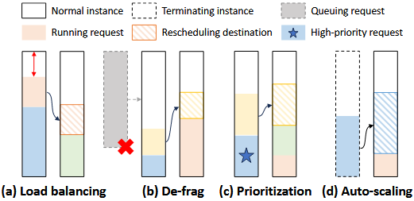
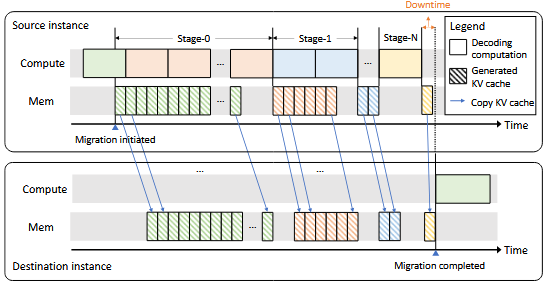
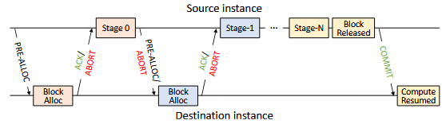
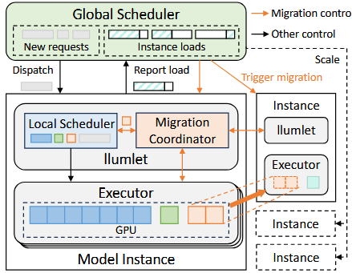
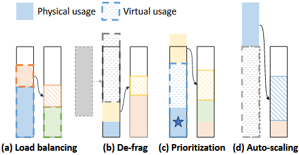
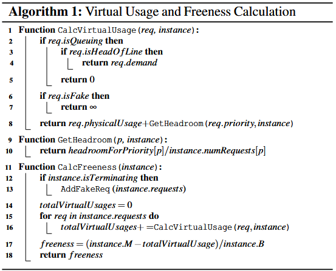

## 论文概述

论文标题：**Llumnix: Dynamic Scheduling for Large Language Model Serving**

核心工作：对于大模型推理服务中，论文构建了Llumnix大模型推理系统实现对**异构并不可预测**的服务请求在多个模型的实例中进行**runtime rescheduling**。类似于操作系统中CPU核心中的上下文切换，Llumnix通过对请求的重新调度，实现了负载均衡、隔离、缓解资源片段、处理请求优先级以及满足Service-Level Objects (SLO)。为了实现请求的重新调度，Llumnix实现了一个实时迁移机制，充分利用动态调度策略，使得多个重新调度的场景能够统一。论文工作的源代码：[Llumnix](Llumnix: Dynamic Scheduling for Large Language Model Serving)

## 论文背景及存在的问题

目前的大模型推理系统由一个大模型的多种实例部署在GPU集群上提供支持。这个系统主要包括一个调度器和一个推理引擎，即服务请求会被调度器分发到一个模型实例中进行推理，在通过推理引擎进行执行并返回推理结果。

通过了解上述推理流程，发现其两个重要特性：

1. workload heterogeneity，即对于大模型而言，它的功能性是普适的，但对于不同的应用场景和用户，他的具体服务请求又是不相同的。也就是不同的服务请求，其输入长度，输出长度，期待的延迟都是不相同的。
2. execution unpredictability，大模型对于服务请求的输出长度是不可知的，那么也就是其服务延迟以及对于所需要的显存也是不可知的。

基于上述两种特性，目前的大模型推理系统主要面临以下挑战：

1. Isolation，由于服务请求的不可知会使得其内存使用的需求不断增长；而系统中的显存又是有限的，即导致不同服务请求之间的显存争用而引起性能干扰。
1. Fragmentation，由于变化的服务请求长度以及显存的需要不可避免地导致内存片段；对于运行的服务请求，系统会考虑负载均衡来分配不同实例的服务请求以减少延迟和抢占。但对于需要大块显存的服务请求而言，复杂均衡所导致的内存片段无法满足推理的需求，导致较长的阻塞延迟。
1. Priority，由于大模型中不同任务的特性不同，所以会影响它们所要求的延迟目标；例如聊天助理需要实时的反馈交互信息，而文章总结等工作就不太在意延迟。

在大模型推理工作中，不同应用的服务请求面临不同的需求，即序列长度和预期延迟。对于大模型推理过程中，自回归生成是以流的形式进行反馈，即**prefill**和**decode**的延迟都是用户可感知并影响用户体验。在目前的大模型推理中，**Batching**的工作方式主要为continous batching，也就是完成的服务请求可以随时加入或离开当前请求；GPU显存的管理主要是基于PagedAttention机制来实现和管理。

## 论文的主要工作

### 重新调度服务请求

1. 满足负载均衡以减少抢占和干扰
2. 去除片段以缓解排队延迟
3. 提供请求优先级以提供隔离
4. 饱和或耗尽实例以满足自动缩放

### 实时迁移机制

Llumnix引入几乎无需停机时间的请求调度机制；对于任意长度都是一个常量，其是通过仔细地协调内存传输和计算来隐藏其所需的费用。

### 统一的重调度场景

为了统一请求重新调度场景的工作，Llumnix引入了**Virtual Usage**概念，通过定义GPU显存的使用规则以现实用简单的复杂均衡方法实现多场景的统一调度任务。

## 论文工作动机

### 无法预测的显存需求和抢占

由于大模型推理的特性，服务请求的显存需求不断增长，可能导致显存不足而需要对当前的部分请求进行抢占以释放显存；这导致其抢占的排队时延以及重新计算KV Cache的计算，从而影响大模型推理的性能。

### 请求间性能干扰

同一个批次间由于资源的竞争，即GPU计算和显存带宽的争用而导致服务请求之间的性能干扰。

### 显存片段

为了缓解服务请求之间的性能干扰，通过负载均衡将请求在实例中进行统一分配；然而，该方法可能会影响到显存片段，也就是未分配的显存。对于**decode**阶段，pagedattention方法有效地解决了外部的显存片段；但对于**prefill**阶段，需要大量的显存资源来初始化服务请求，由于负载均衡可能导致无法找到满足要求的实例，使得产生较大的排队时延。

### 请求优先级

显而易见，即当前的推理系统对于所有的服务请求一视同仁，而不同的应用实际上对推理延迟有着不同的要求，需要一个系统性的方法来满足每个服务请求所需的延迟目标。

## 实时迁移机制

为了实现服务请求的实时迁移机制，论文中基于KV Cache的重要特性，即其是**append-only**且不会修改之前的数据；基于该特性，论文参考 Virtual Machine live migration 机制来实现服务请求的动态迁移。其流程主要为请求的当前实例继续推理服务请求，而传输已生成的 KV Cache 数据到目标实例，下一阶段则传输新生成的 KV Cache 并继续进行推理，直至当前推理仅生成一个新的 KV Cache ，则仅传输数据而不进行推理实现服务请求的迁移。

基于上述的实时迁移机制，仍然面临这两个挑战，即：

1. 目标实例由于服务请求所需显存的不可知，可能导致显存溢出；
2. 服务请求可能在迁移的过程中已经完成，而不会转移到目标实例中。

为了解决上述问题，论文提出了握手协议，即每个传输阶段之前向目标实例申请显存空间以传输KV Cache数据，且目标实例返回通知信息；如果服务请求已完成传输或者被抢占，则提醒目标实例已完成传输，可以直接进行计算。

## 分布式调度架构

基于上述的实时迁移机制，推理系统需要追踪每个服务请求的状态已进行调度或迁移，这提出了较大的挑战；为了解决这个问题，论文提出了分布式的调度架构，即一个**cluster-level**的全局调度器和**instance-level**的本地调度器**llumet**。全局和本地调度器仅通过接口进行通信，使得两者有着清晰的分界。在论文中，全局调度其主要保存每个实例当前的显存负载情况，并基于该信息进行服务请求的派发和请求的迁移。对于**llumet**，其由一个本地调度器和迁移协调器组成，本地调度器主要计算当前的工作负载并与全局调度器交互 (注，该负载并不是物理负载，而是下文中的**virtual usage**)；同时，本地调度器决定当前实例的请求的迁移，并通过协调器实现请求的迁移。

## 动态调度策略

### 目标和定义

Llumnix的调度目标主要为：

1. 通过减少排队时延、抢占、干扰来改善**prefill**和**decode**的延迟；
2. 处理变化的集群负载并提升性价比来实现**load-adaptivity**；
3. Llumnix实现两种优先级级别以提升推理系统对不同应用的表现。

### Virtual Usage

为了统一负载均衡以及释放空间 (移除片段、优先级、耗尽实例) 的需求，论文通过假设实例的 **virtual usage**使得负载均衡能够统一释放空间的要求。

对于正常的负载均衡，论文无需做任何处理，直接计算对于的物理空间即可；对于排队的请求，则需要在现有实例上添加排队请求来计算**virtual usage**；对于执行的优先级，则对于实例中的这些任务提供预留的**virtual usage**来减少干扰；但对于新实例加入或实例停机，则考虑正常的负载均衡或设置无限的**virtual usage**以强制迁移。

### 调度策略

对于服务请求的分发，优先对优先级较高的请求进行分发；对于相同的优先级，则采用FCFS的调度方法。对于具体实例的选择，则基于每个实例目前的空闲度进行计算，来实现对具体分发实例的选择，该算法会在下面进行展示。

对于服务请求的迁移，Llumnix是周期性触发的，即每个周期选择低于或超过对应阈值的实例，对两者进行服务请求的迁移。对于**llumlet**会优先选择优先级较低和序列长度较短的请求进行任务迁移。如果在迁移过程中，实例没有超过阈值，则取消迁移。

对于自动缩放，Llumnix自动计算全部实例的平均空闲值，判断其是否位于阈值中；如果值位于阈值中，则正常运行，否则对负载最小的实例停机或者添加实例。

## Llumnix 实现

Llumnix 仅使用3300行Python代码实现，其通过单一的接口与后端进行通信，目前支持的后端为vLLM。

Llumnix实例化多个后端作为Ray actors，使得这些实例能够细粒度地进行管理。Llumnix同时开发类OpenAI前端，以向用户提供服务，同时需求迁移时也会将结果传输给前端，保障整体性能的稳定。

Llumnix使用Gloo来进行KV Cache的传输，而不使用NCCL (推理通信使用的也是NCCL，防止两者相互干扰；

对于PagedAttention对GPU显存的块进行随机分配，为了提高效率，Llumnix将数据传输到CPU整合到一起，再进行统一传输。

对于全局调度器失效，将会使用简单的分配策略并禁止迁移；如果实例失效，则放弃其服务请求以及正在迁移的请求；并且这些实例将会通过Ray重新启动，以恢复正常的工作状态。

## 未来工作

1. 涉及全局调度器和局部调度器之间的相互作用；
2. 拓展Llumnix去支持多种模型以及其变种的部署推理。